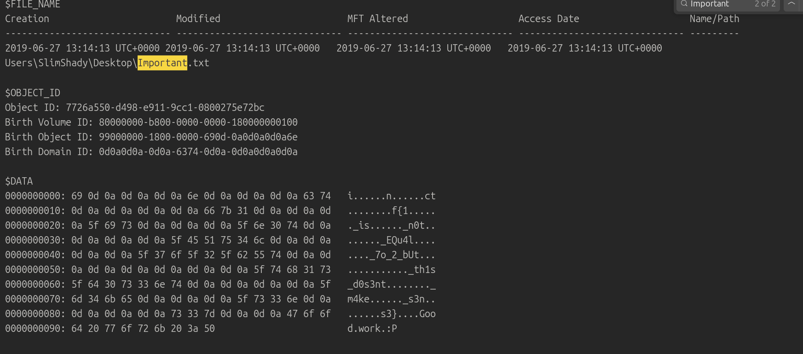

# Memlabs lab 4

challenge description
```
My system was recently compromised. The Hacker stole a lot of information but he also deleted a very important file of mine. I have no idea on how to recover it. The only evidence we have, at this point of time is this memory dump. Please help me.

Note: This challenge is composed of only 1 flag.

The flag format for this lab is: inctf{s0me_l33t_Str1ng}
```
challenge file - [file](https://mega.nz/#!Tx41jC5K!ifdu9DUair0sHncj5QWImJovfxixcAY-gt72mCXmYrE)

# Solution
- we have the memory dump , first getting its profile and seeing what processes where running


```bash
stapat@stapat:~/ehax/dfir/memlabs/lab4$ volatility -f chall.raw imageinfo
Volatility Foundation Volatility Framework 2.6.1
INFO    : volatility.debug    : Determining profile based on KDBG search...
          Suggested Profile(s) : Win7SP1x64, Win7SP0x64, Win2008R2SP0x64, Win2008R2SP1x64_24000, Win2008R2SP1x64_23418, Win2008R2SP1x64, Win7SP1x64_24000, Win7SP1x64_23418
                     AS Layer1 : WindowsAMD64PagedMemory (Kernel AS)
                     AS Layer2 : FileAddressSpace (/mnt/data/symlinks/ehax/dfir/memlabs/lab4/chall.raw)
                      PAE type : No PAE
                           DTB : 0x187000L
                          KDBG : 0xf800027f60a0L
          Number of Processors : 1
     Image Type (Service Pack) : 1
                KPCR for CPU 0 : 0xfffff800027f7d00L
             KUSER_SHARED_DATA : 0xfffff78000000000L
           Image date and time : 2019-06-29 07:30:00 UTC+0000
     Image local date and time : 2019-06-29 13:00:00 +0530
stapat@stapat:~/ehax/dfir/memlabs/lab4$ volatility -f chall.raw --profile=Win7SP1x64 psxview
Volatility Foundation Volatility Framework 2.6.1
Offset(P)          Name                    PID pslist psscan thrdproc pspcid csrss session deskthrd ExitTime
------------------ -------------------- ------ ------ ------ -------- ------ ----- ------- -------- --------
0x000000003e920350 conhost.exe            2636 True   True   True     True   True  True    True     
0x000000003f1c1b30 services.exe            472 True   True   True     True   True  True    False    
0x000000003fc62b30 dwm.exe                3000 True   True   True     True   True  True    True     
0x000000003e930060 winlogon.exe           2728 True   True   True     True   True  True    True     
0x000000003ec1b890 svchost.exe             220 True   True   True     True   True  True    True     
0x000000003e8f0610 GoogleCrashHan         2272 True   True   True     True   True  True    False    
0x000000003eaa4420 DumpIt.exe             2624 True   True   True     True   True  True    True     
0x000000003efb9b30 svchost.exe             840 True   True   True     True   True  True    False    
0x000000003ecaab30 spoolsv.exe            1132 True   True   True     True   True  True    True     
0x000000003fceeb30 VBoxTray.exe           2384 True   True   True     True   True  True    True     
0x000000003efacb30 svchost.exe             804 True   True   True     True   True  True    True     
0x000000003eec1b30 lsm.exe                 488 True   True   True     True   True  True    False    
0x000000003eaf7b30 explorer.exe           1944 True   True   True     True   True  True    True     
0x000000003e86e910 SearchProtocol         1696 True   True   True     True   True  True    True     
0x000000003fcaeb30 explorer.exe           3012 True   True   True     True   True  True    True     
0x000000003ed81b30 taskhost.exe           1804 True   True   True     True   True  True    True     
0x000000003ef30b30 VBoxService.ex          640 True   True   True     True   True  True    False    
0x000000003eeb5940 lsass.exe               480 True   True   True     True   True  True    False    
0x000000003eff1060 audiodg.exe             952 True   True   True     True   True  True    True     
0x000000003e892b30 dllhost.exe            2076 True   True   True     True   True  True    True     
0x000000003ec45630 svchost.exe             484 True   True   True     True   True  True    True     
0x000000003fc54b30 taskhost.exe           2976 True   True   True     True   True  True    True     
0x000000003efc6850 svchost.exe             864 True   True   True     True   True  True    True     
0x000000003e8f6b30 GoogleCrashHan         2284 True   True   True     True   True  True    False    
0x000000003edf9630 taskeng.exe            1824 True   True   True     True   True  True    False    
0x000000003ecd7b30 svchost.exe            1176 True   True   True     True   True  True    True     
0x000000003ed452e0 svchost.exe            1276 True   True   True     True   True  True    True     
0x000000003fd18b30 StikyNot.exe           2432 True   True   True     True   True  True    True     
0x000000003ee6f760 wininit.exe             384 True   True   True     True   True  True    True     
0x000000003e879890 SearchFilterHo         1688 True   True   True     True   True  True    True     
0x000000003ebabab0 VBoxTray.exe           1592 True   True   True     True   True  True    True     
0x000000003eabbb30 dwm.exe                1908 True   True   True     True   True  True    True     
0x000000003ee751f0 winlogon.exe            412 True   True   True     True   True  True    True     
0x000000003ef43a70 svchost.exe             708 True   True   True     True   True  True    True     
0x000000003e801ab0 SearchIndexer.         1068 True   True   True     True   True  True    False    
0x000000003ef02b30 svchost.exe             580 True   True   True     True   True  True    False    
0x000000003ff67960 csrss.exe               376 True   True   True     True   False True    True     
0x000000003ee57b30 csrss.exe               328 True   True   True     True   False True    True     
0x000000003ff5f040 System                    4 True   True   True     True   False False   False    
0x000000003f6af950 smss.exe                256 True   True   True     True   False False   False    
0x000000003eeac460 csrss.exe              2700 True   True   True     True   False True    True     
0x000000003edfab30 LogonUI.exe            2148 False  True   False    False  False False   False    2019-06-29 07:29:59 UTC+0000
0x000000003ea94630 csrss.exe              2672 False  True   False    False  False False   False    2019-06-29 07:29:59 UTC+0000
0x000000003fc5ab30 dllhost.exe            2572 False  True   False    False  False False   False    2019-06-29 07:30:07 UTC+0000
```
- we can see only one eye catching process which is StikyNot.exe , this is not a known application , probably a malware so lets just ignore it for now

- looking for some files as the description mentioned deletion of files , it reminds me on internet explorer history ( not tho , read from a writeup 😭)
- checking the filescan and ie history for files opened ( for .txt, .jpg , .png etc)
```bash
stapat@stapat:~/ehax/dfir/memlabs/lab4$ volatility -f chall.raw --profile=Win7SP1x64 iehistory
Volatility Foundation Volatility Framework 2.6.1
**************************************************
Process: 1944 explorer.exe
Cache type "URL " at 0x44f5080
Record length: 0x300
Location: https://www.microsoft.com/favicon.ico?v2
Last modified: 2015-06-09 04:52:20 UTC+0000
Last accessed: 2019-06-24 15:47:21 UTC+0000
File Offset: 0x300, Data Offset: 0x94, Data Length: 0xa4
File: favicon[1].ico
Data: HTTP/1.1 200 OK
ETag: "1D0A270110F5A00"
Content-Type: image/x-icon
Content-Length: 17174
Access-Control-Allow-Credentials: true
Access-Control-Allow-Headers: Origin, X-Requested-With, Content-Type, Accept
Access-Control-Allow-Methods: GET, POST, PUT, DELETE, OPTIONS
P3P: CP="ALL IND DSP COR ADM CONo CUR CUSo IVAo IVDo PSA PSD TAI TELo OUR SAMo CNT COM INT NAV ONL PHY PRE PUR UNI"
X-Frame-Options: SAMEORIGIN
TLS_version: tls1
Strict-Transport-Security: max-age=31536000
X-RTag: RT

~U:eminem

**************************************************
Process: 1944 explorer.exe
Cache type "URL " at 0x44f5380
Record length: 0x180
Location: https://www.google.com/favicon.ico
Last modified: 2016-12-08 01:00:57 UTC+0000
Last accessed: 2019-06-24 15:47:24 UTC+0000
File Offset: 0x180, Data Offset: 0x8c, Data Length: 0x9c
File: favicon[1].ico
Data: HTTP/1.1 200 OK
Content-Type: image/x-icon
X-Content-Type-Options: nosniff
X-XSS-Protection: 0
Alt-Svc: quic=":443"; ma=2592000; v="46,44,43,39"
Content-Length: 5430

~U:eminem

**************************************************
Process: 1944 explorer.exe
Cache type "URL " at 0x44f5500
Record length: 0x180
Location: https://www.google.com/chrome/static/images/favicons/favicon.ico
Last modified: 2018-04-26 05:30:00 UTC+0000
Last accessed: 2019-06-24 15:47:49 UTC+0000
File Offset: 0x180, Data Offset: 0xac, Data Length: 0xbc
File: favicon[1].ico
Data: HTTP/1.1 200 OK
Content-Type: image/x-icon
X-Content-Type-Options: nosniff
X-XSS-Protection: 0
Alt-Svc: quic=":443"; ma=2592000; v="46,44,43,39"
Transfer-Encoding: chunked

~U:eminem

**************************************************
Process: 1944 explorer.exe
Cache type "URL " at 0x44f5780
Record length: 0x180
Location: https://s1.wp.com/opensearch.xml
Last modified: 2015-01-31 06:24:24 UTC+0000
Last accessed: 2019-06-24 15:49:55 UTC+0000
File Offset: 0x180, Data Offset: 0x8c, Data Length: 0xa0
File: opensearch[1].xml
Data: HTTP/1.1 200 OK
Content-Type: text/xml
Transfer-Encoding: chunked
ETag: W/"54cc7518-3f7"
X-ac: 4.bom _dca
X-nc: HIT bom 32

~U:eminem

**************************************************
Process: 1944 explorer.exe
Cache type "URL " at 0x44f5900
Record length: 0x180
Location: https://qpdownload.com/data/dumpit/thumbnail/thumbnail.png
Last modified: 2018-01-31 20:32:00 UTC+0000
Last accessed: 2019-06-25 12:18:50 UTC+0000
File Offset: 0x180, Data Offset: 0xa4, Data Length: 0xb8
File: thumbnail[1].png
Data: HTTP/1.1 200 OK
Content-Type: image/png
Content-Length: 2707
Keep-Alive: timeout=60
ETag: "5a7227c0-a93"

~U:eminem

**************************************************
Process: 1944 explorer.exe
Cache type "URL " at 0x44f5a80
Record length: 0x280
Location: http://img.losoradep.com/img/Tefenece/Tefenece_logo_black.png
Last modified: 2015-12-15 08:00:29 UTC+0000
Last accessed: 2019-06-25 12:18:58 UTC+0000
File Offset: 0x280, Data Offset: 0xa8, Data Length: 0xc4
File: Tefenece_logo_black[1].png
Data: HTTP/1.1 200 OK
Content-Type: image/png
Content-Length: 1864
x-amz-id-2: IRVqhRGrovKXLUE/vgrNmklYPmZ4TDkbDcyflXObYE3dgqft0Y6bpqOiENGIaKTmD0eaGQsN8lY=
x-amz-request-id: 695645337EE3B89E
ETag: "a53385c7239a3a59b0f2a3ccd46bf2bc"
x-amz-meta-cb-modifiedtime: Tue, 15 Dec 2015 07:58:34 GMT
x-amz-version-id: Zwf4KvKkRODTbnlzCLFVlgxirVapCH0M

~U:eminem

**************************************************
Process: 1944 explorer.exe
Cache type "URL " at 0x44f5d00
Record length: 0x280
Location: http://img.losoradep.com/img/Jimomoromoj/Jimomoromoj_logo.png
Last modified: 2015-12-10 15:13:12 UTC+0000
Last accessed: 2019-06-25 12:18:58 UTC+0000
File Offset: 0x280, Data Offset: 0xa8, Data Length: 0xc0
File: Jimomoromoj_logo[1].png
Data: HTTP/1.1 200 OK
Content-Type: image/png
Content-Length: 2152
x-amz-id-2: InGmSrdMczbROZ15nUw5L45BA1xtYO8ec+7lo0j6243vHFiSSuHRdf8DaPHc6jQuCZrH4RinsjU=
x-amz-request-id: 6BFCB65C35122E25
ETag: "a42fffd68be18b8ae986986a71521138"
x-amz-meta-cb-modifiedtime: Thu, 10 Dec 2015 15:12:08 GMT
x-amz-version-id: PrH8qsAjd_ylEeG7YqHUP2..XWuIuUuI

~U:eminem

**************************************************
Process: 1944 explorer.exe
Cache type "URL " at 0x44f7000
Record length: 0x280
Location: http://img.losoradep.com/img/Tavasat/15Feb17/v2/EN.png
Last modified: 2017-02-19 16:59:25 UTC+0000
Last accessed: 2019-06-25 12:18:59 UTC+0000
File Offset: 0x280, Data Offset: 0xa0, Data Length: 0xac
File: EN[1].png
Data: HTTP/1.1 200 OK
Content-Type: image/png
Content-Length: 45049
x-amz-id-2: ohDlv+iSoZyBvKAfeq4G3kkHzUXxdQZ7KevA4TNnXhkE73fgGo7shkvE0bUD2xG03zfekPr0/ps=
x-amz-request-id: BBF3B74F013B1120
ETag: "46bd51d12590a67a66cc21ba18059a20"
x-amz-meta-cb-modifiedtime: Sun, 19 Feb 2017 14:58:10 GMT
x-amz-version-id: sopMf1j2SI4GDLqT6_MqgCrNguY9LFuw

~U:eminem

**************************************************
Process: 1944 explorer.exe
Cache type "URL " at 0x44f7280
Record length: 0x280
Location: http://img.losoradep.com/img/Vavavag/V2/IN.png
Last modified: 2017-12-01 08:50:27 UTC+0000
Last accessed: 2019-06-25 12:18:59 UTC+0000
File Offset: 0x280, Data Offset: 0x98, Data Length: 0xa4
File: IN[1].png
Data: HTTP/1.1 200 OK
Content-Type: image/png
Content-Length: 48333
x-amz-id-2: M8Tv2yzlqtYT5ZQvLrn4YOcsy496Df2MWM1AObcnbDwL2PEpTOg4gicdLBma7b1YRmeO+McIuPA=
x-amz-request-id: C58754B9939CF8B9
ETag: "9267184f8268a90f9b07385228788f61"
x-amz-meta-cb-modifiedtime: Fri, 01 Dec 2017 08:46:32 GMT
x-amz-version-id: 23Yxe.sO3KN2KekTFLZ2vxiLm.WzNPzx

~U:eminem

**************************************************
Process: 1944 explorer.exe
Cache type "URL " at 0x4515000
Record length: 0x100
Location: Visited: eminem@http://www.msn.com/?ocid=iehp
Last modified: 2019-06-24 15:47:06 UTC+0000
Last accessed: 2019-06-24 15:47:06 UTC+0000
File Offset: 0x100, Data Offset: 0x0, Data Length: 0x98
**************************************************
Process: 1944 explorer.exe
Cache type "URL " at 0x4515100
Record length: 0x100
Location: Visited: eminem@http://static-global-s-msn-com.akamaized.net/hp-eas/sc/2b/a5ea21.ico
Last modified: 2019-06-24 15:47:09 UTC+0000
Last accessed: 2019-06-24 15:47:09 UTC+0000
File Offset: 0x100, Data Offset: 0x0, Data Length: 0xc0
**************************************************
Process: 1944 explorer.exe
Cache type "URL " at 0x4515200
Record length: 0x100
Location: Visited: eminem@http://go.microsoft.com/fwlink/?LinkId=69157
Last modified: 2019-06-24 15:47:07 UTC+0000
Last accessed: 2019-06-24 15:47:07 UTC+0000
File Offset: 0x100, Data Offset: 0x0, Data Length: 0xa8
**************************************************
Process: 1944 explorer.exe
Cache type "URL " at 0x4515300
Record length: 0x100
Location: Visited: eminem@https://support.microsoft.com/internet-explorer
Last modified: 2019-06-24 15:47:09 UTC+0000
Last accessed: 2019-06-24 15:47:09 UTC+0000
File Offset: 0x100, Data Offset: 0x0, Data Length: 0xa8
**************************************************
Process: 1944 explorer.exe
Cache type "URL " at 0x4515400
Record length: 0x100
Location: Visited: eminem@https://ieonline.microsoft.com/favicon.ico
Last modified: 2019-06-24 15:47:11 UTC+0000
Last accessed: 2019-06-24 15:47:11 UTC+0000
File Offset: 0x100, Data Offset: 0x0, Data Length: 0xa4
**************************************************
Process: 1944 explorer.exe
Cache type "URL " at 0x4515500
Record length: 0x100
Location: Visited: eminem@file:///C:/Users/eminem/Downloads/galf.jpeg
Last modified: 2019-06-25 12:42:58 UTC+0000
Last accessed: 2019-06-25 12:42:58 UTC+0000
File Offset: 0x100, Data Offset: 0x0, Data Length: 0xa4
**************************************************
Process: 1944 explorer.exe
Cache type "URL " at 0x4515600
Record length: 0x180
Location: Visited: eminem@http://www.msn.com/en-in/?ocid=iehp
Last modified: 2019-06-24 15:47:11 UTC+0000
Last accessed: 2019-06-24 15:47:11 UTC+0000
File Offset: 0x180, Data Offset: 0x0, Data Length: 0x9c
**************************************************
Process: 1944 explorer.exe
Cache type "URL " at 0x4515780
Record length: 0x100
Location: Visited: eminem@http://go.microsoft.com/fwlink/?LinkID=121792
Last modified: 2019-06-24 15:47:11 UTC+0000
Last accessed: 2019-06-24 15:47:11 UTC+0000
File Offset: 0x100, Data Offset: 0x0, Data Length: 0xa8
**************************************************
Process: 1944 explorer.exe
Cache type "URL " at 0x4515880
Record length: 0x100
Location: Visited: eminem@https://www.google.com/?gws_rd=ssl
Last modified: 2019-06-24 15:49:23 UTC+0000
Last accessed: 2019-06-24 15:49:23 UTC+0000
File Offset: 0x100, Data Offset: 0x0, Data Length: 0x9c
**************************************************
Process: 1944 explorer.exe
Cache type "URL " at 0x4515980
Record length: 0x100
Location: Visited: eminem@https://volatilevirus.home.blog/favicon.ico
Last modified: 2019-06-24 15:49:59 UTC+0000
Last accessed: 2019-06-24 15:49:59 UTC+0000
File Offset: 0x100, Data Offset: 0x0, Data Length: 0xa4
**************************************************
Process: 1944 explorer.exe
Cache type "URL " at 0x4515a80
Record length: 0x200
Location: Visited: eminem@https://www.google.com/search?hl=en-IN&source=hp&biw=&bih=&q=Google+chrome+latest+version+download&gbv=2
Last modified: 2019-06-24 15:47:40 UTC+0000
Last accessed: 2019-06-24 15:47:40 UTC+0000
File Offset: 0x200, Data Offset: 0x0, Data Length: 0xe4
**************************************************
Process: 1944 explorer.exe
Cache type "URL " at 0x4515c80
Record length: 0x180
Location: Visited: eminem@https://www.google.com/search?hl=en-IN&source=hp&biw=&bih=&q=Ashutosh+Ahelleya&gbv=2
Last modified: 2019-06-24 15:49:31 UTC+0000
Last accessed: 2019-06-24 15:49:31 UTC+0000
File Offset: 0x180, Data Offset: 0x0, Data Length: 0xd0
**************************************************
Process: 1944 explorer.exe
Cache type "URL " at 0x4515e00
Record length: 0x180
Location: Visited: eminem@https://www.google.com/search?q=Abhiram+Kumar&hl=en-IN&gbv=2
Last modified: 2019-06-24 15:49:36 UTC+0000
Last accessed: 2019-06-24 15:49:36 UTC+0000
File Offset: 0x180, Data Offset: 0x0, Data Length: 0xb8
**************************************************
Process: 1944 explorer.exe
Cache type "URL " at 0x4516000
Record length: 0x180
Location: Visited: eminem@https://www.google.com/search?hl=en-IN&source=hp&biw=&bih=&q=Volatilevirus&gbv=2
Last modified: 2019-06-24 15:48:01 UTC+0000
Last accessed: 2019-06-24 15:48:01 UTC+0000
File Offset: 0x180, Data Offset: 0x0, Data Length: 0xcc
**************************************************
Process: 1944 explorer.exe
Cache type "URL " at 0x4516180
Record length: 0x180
Location: Visited: eminem@https://support.microsoft.com/hub/4230784/internet-explorer-help
Last modified: 2019-06-24 15:47:21 UTC+0000
Last accessed: 2019-06-24 15:47:21 UTC+0000
File Offset: 0x180, Data Offset: 0x0, Data Length: 0xbc
**************************************************
Process: 1944 explorer.exe
Cache type "URL " at 0x4516300
Record length: 0x180
Location: Visited: eminem@https://volatilevirus.home.blog
Last modified: 2019-06-24 15:49:55 UTC+0000
Last accessed: 2019-06-24 15:49:55 UTC+0000
File Offset: 0x180, Data Offset: 0x0, Data Length: 0x98
**************************************************
Process: 1944 explorer.exe
Cache type "URL " at 0x4516480
Record length: 0x180
Location: Visited: eminem@https://www.google.com/url?url=https://volatilevirus.home.blog/&rct=j&frm=1&q=&esrc=s&sa=U&ved=0ahUKEwjMiNTlu4LjAhUDSX0KHa0dDIMQFggWMAA&usg=AOvVaw3n0I9zOmlnQ6CFSkJPgKGC
Last modified: 2019-06-24 15:48:09 UTC+0000
Last accessed: 2019-06-24 15:48:09 UTC+0000
File Offset: 0x180, Data Offset: 0x0, Data Length: 0x124
**************************************************
Process: 1944 explorer.exe
Cache type "URL " at 0x4516600
Record length: 0x180
Location: Visited: eminem@https://volatilevirus.home.blog/comments/feed
Last modified: 2019-06-24 15:49:54 UTC+0000
Last accessed: 2019-06-24 15:49:54 UTC+0000
File Offset: 0x180, Data Offset: 0x0, Data Length: 0xa8
**************************************************
Process: 1944 explorer.exe
Cache type "URL " at 0x4516780
Record length: 0x200
Location: Visited: eminem@https://www.google.com/chrome/thank-you.html?brand=CHBD&statcb=1&clickonceinstalled=1&installdataindex=defaultbrowser
Last modified: 2019-06-24 15:52:40 UTC+0000
Last accessed: 2019-06-24 15:52:40 UTC+0000
File Offset: 0x200, Data Offset: 0x0, Data Length: 0xf0
**************************************************
Process: 1944 explorer.exe
Cache type "URL " at 0x4516980
Record length: 0x180
Location: Visited: eminem@https://volatilevirus.home.blog
Last modified: 2019-06-24 15:52:41 UTC+0000
Last accessed: 2019-06-24 15:52:41 UTC+0000
File Offset: 0x180, Data Offset: 0x0, Data Length: 0x98
**************************************************
Process: 1944 explorer.exe
Cache type "URL " at 0x4517000
Record length: 0x200
Location: Visited: eminem@https://www.google.com/chrome/?brand=CHBD&gclid=EAIaIQobChMIu6Pr27uC4wIVzg0rCh22wQtKEAAYASAAEgLe6fD_BwE&gclsrc=aw.ds
Last modified: 2019-06-24 15:48:13 UTC+0000
Last accessed: 2019-06-24 15:48:13 UTC+0000
File Offset: 0x200, Data Offset: 0x0, Data Length: 0xf0
**************************************************
Process: 1944 explorer.exe
Cache type "URL " at 0x4517200
Record length: 0x200
Location: Visited: eminem@https://dl.google.com/update2/installers/clickonce/GoogleInstaller_en.application?appguid%3D%7B8A69D345-D564-463C-AFF1-A69D9E530F96%7D%26iid%3D%7B877B1EFD-133E-54A2-2149-9907E65F53BF%7D%26lang%3Den%26browser%3D2%26usagestats%3D1%26appname%3DGoogle%2520Chrome%26needsadmin%3Dprefers%26ap%3Dx64-stable-statsdef_1%26brand%3DCHBD%26installdataindex%3Ddefaultbrowser
Last modified: 2019-06-24 15:48:22 UTC+0000
Last accessed: 2019-06-24 15:48:22 UTC+0000
File Offset: 0x200, Data Offset: 0x0, Data Length: 0x1e4
**************************************************
Process: 1944 explorer.exe
Cache type "URL " at 0x4517400
Record length: 0x200
Location: Visited: eminem@https://www.google.com/chrome/thank-you.html?brand=CHBD&statcb=1&clickonceinstalled=1&installdataindex=defaultbrowser
Last modified: 2019-06-24 15:52:42 UTC+0000
Last accessed: 2019-06-24 15:52:42 UTC+0000
File Offset: 0x200, Data Offset: 0x0, Data Length: 0xf0
**************************************************
Process: 1944 explorer.exe
Cache type "URL " at 0x4517600
Record length: 0x100
Location: Visited: eminem@https://volatilevirus.home.blog/feed
Last modified: 2019-06-24 15:49:54 UTC+0000
Last accessed: 2019-06-24 15:49:54 UTC+0000
File Offset: 0x100, Data Offset: 0x0, Data Length: 0xa0
**************************************************
Process: 1944 explorer.exe
Cache type "URL " at 0x4517700
Record length: 0x100
Location: Visited: eminem@file:///C:/Users/eminem/Desktop/secrets.txt
Last modified: 2019-06-25 14:34:28 UTC+0000
Last accessed: 2019-06-25 14:34:28 UTC+0000
File Offset: 0x100, Data Offset: 0x0, Data Length: 0xa4
**************************************************
Process: 1944 explorer.exe
Cache type "URL " at 0x4517800
Record length: 0x100
Location: Visited: eminem@file:///C:/Users/eminem/Desktop/flag.txt.txt
Last modified: 2019-06-25 12:47:15 UTC+0000
Last accessed: 2019-06-25 12:47:15 UTC+0000
File Offset: 0x100, Data Offset: 0x0, Data Length: 0xa8
**************************************************
Process: 1944 explorer.exe
Cache type "URL " at 0x4517900
Record length: 0x100
Location: Visited: eminem@file:///C:/Program%20Files/Reference%20Assemblies/Microsoft/Framework/v3.0/RedistList/Important.txt.txt
Last modified: 2019-06-25 15:08:33 UTC+0000
Last accessed: 2019-06-25 15:08:33 UTC+0000
File Offset: 0x100, Data Offset: 0x0, Data Length: 0xe0
**************************************************
Process: 1944 explorer.exe
Cache type "URL " at 0x4517a00
Record length: 0x100
Location: Visited: eminem@file:///C:/Users/eminem/Desktop/New%20Text%20Document.txt
Last modified: 2019-06-26 15:27:07 UTC+0000
Last accessed: 2019-06-26 15:27:07 UTC+0000
File Offset: 0x100, Data Offset: 0x0, Data Length: 0xb4
**************************************************
Process: 1944 explorer.exe
Cache type "URL " at 0x4517b00
Record length: 0x100
Location: Visited: eminem@file:///C:/Users/eminem/Desktop/Important.txt.txt
Last modified: 2019-06-25 15:06:00 UTC+0000
Last accessed: 2019-06-25 15:06:00 UTC+0000
File Offset: 0x100, Data Offset: 0x0, Data Length: 0xac
**************************************************
Process: 1944 explorer.exe
Cache type "URL " at 0x4517c00
Record length: 0x100
Location: Visited: eminem@file:///C:/Users/eminem/Desktop/Screenshot1.png
Last modified: 2019-06-27 13:26:38 UTC+0000
Last accessed: 2019-06-27 13:26:38 UTC+0000
File Offset: 0x100, Data Offset: 0x0, Data Length: 0xa8
**************************************************
Process: 1944 explorer.exe
Cache type "URL " at 0x4517d00
Record length: 0x100
Location: Visited: eminem@file:///C:/Users/eminem/Desktop/Important.txt
Last modified: 2019-06-26 12:01:46 UTC+0000
Last accessed: 2019-06-26 12:01:46 UTC+0000
File Offset: 0x100, Data Offset: 0x0, Data Length: 0xa8
**************************************************
Process: 1944 explorer.exe
Cache type "URL " at 0x4517e00
Record length: 0x100
Location: Visited: eminem@file:///C:/Users/eminem/Desktop/Screenshot1.png
Last modified: 2019-06-29 07:29:06 UTC+0000
Last accessed: 2019-06-29 07:29:06 UTC+0000
File Offset: 0x100, Data Offset: 0x0, Data Length: 0xa8
**************************************************
Process: 1944 explorer.exe
Cache type "URL " at 0x4517f00
Record length: 0x100
Location: Visited: eminem@file:///C:/Users/eminem/Desktop/galf.jpeg
Last modified: 2019-06-29 07:29:04 UTC+0000
Last accessed: 2019-06-29 07:29:04 UTC+0000
File Offset: 0x100, Data Offset: 0x0, Data Length: 0xa4
**************************************************
Process: 1944 explorer.exe
Cache type "URL " at 0x4518000
Record length: 0x100
Location: Visited: eminem@file:///C:/Users/eminem/Desktop/Flag%20not%20here.bmp
Last modified: 2019-06-29 07:29:04 UTC+0000
Last accessed: 2019-06-29 07:29:04 UTC+0000
File Offset: 0x100, Data Offset: 0x0, Data Length: 0xb0
**************************************************
Process: 1944 explorer.exe
Cache type "URL " at 0x4a35000
Record length: 0x100
Location: :2019062920190630: eminem@file:///C:/Users/eminem/Desktop/Flag%20not%20here.bmp
Last modified: 2019-06-29 12:59:04 UTC+0000
Last accessed: 2019-06-29 07:29:04 UTC+0000
File Offset: 0x100, Data Offset: 0x0, Data Length: 0x0
**************************************************
Process: 1944 explorer.exe
Cache type "URL " at 0x4a35100
Record length: 0x100
Location: :2019062920190630: eminem@:Host: Computer
Last modified: 2019-06-29 12:59:04 UTC+0000
Last accessed: 2019-06-29 07:29:04 UTC+0000
File Offset: 0x100, Data Offset: 0x0, Data Length: 0x0
**************************************************
Process: 1944 explorer.exe
Cache type "URL " at 0x4a35200
Record length: 0x100
Location: :2019062920190630: eminem@file:///C:/Users/eminem/Desktop/galf.jpeg
Last modified: 2019-06-29 12:59:04 UTC+0000
Last accessed: 2019-06-29 07:29:04 UTC+0000
File Offset: 0x100, Data Offset: 0x0, Data Length: 0x0
**************************************************
Process: 1944 explorer.exe
Cache type "URL " at 0x4a35300
Record length: 0x100
Location: :2019062920190630: eminem@file:///C:/Users/eminem/Desktop/Screenshot1.png
Last modified: 2019-06-29 12:59:06 UTC+0000
Last accessed: 2019-06-29 07:29:06 UTC+0000
File Offset: 0x100, Data Offset: 0x0, Data Length: 0x0
**************************************************
Process: 3012 explorer.exe
Cache type "URL " at 0x20f5000
Record length: 0x100
Location: Visited: SlimShady@file:///C:/Users/SlimShady/Desktop/Important.txt
Last modified: 2019-06-29 07:29:43 UTC+0000
Last accessed: 2019-06-29 07:29:43 UTC+0000
File Offset: 0x100, Data Offset: 0x0, Data Length: 0xac
**************************************************
Process: 3012 explorer.exe
Cache type "URL " at 0x20f5100
Record length: 0x100
Location: Visited: SlimShady@file:///C:/Users/SlimShady/Desktop/Important.txt
Last modified: 2019-06-27 13:14:18 UTC+0000
Last accessed: 2019-06-27 13:14:18 UTC+0000
File Offset: 0x100, Data Offset: 0x0, Data Length: 0xac
**************************************************
Process: 3012 explorer.exe
Cache type "URL " at 0x42f5000
Record length: 0x100
Location: :2019062920190630: SlimShady@file:///C:/Users/SlimShady/Desktop/Important.txt
Last modified: 2019-06-29 12:59:43 UTC+0000
Last accessed: 2019-06-29 07:29:43 UTC+0000
File Offset: 0x100, Data Offset: 0x0, Data Length: 0x0
**************************************************
Process: 3012 explorer.exe
Cache type "URL " at 0x42f5100
Record length: 0x100
Location: :2019062920190630: SlimShady@:Host: Computer
Last modified: 2019-06-29 12:59:43 UTC+0000
Last accessed: 2019-06-29 07:29:43 UTC+0000
File Offset: 0x100, Data Offset: 0x0, Data Length: 0x0
```


- we can see , ```Important.txt``` , ```screenshot.png``` and one or two other images 
- using filescan to get the offset and extracting the files with dumpfiles ```volatility -f chall.raw --profile=Win7SP1x64 dumpfiles -Q (offset) -D (directory)```

Screenshot1.png


- we didnt get anything useful but we dumpfiles coudnt extract Important.txt , so this was the deleted file the description was talking about
- now after reading some writeups and articles i got to know that , every ntfs file system has a mft table , every file on ntfs systmem has a entry in the mft table which includes , timestamps and all the information about the file 
- if the file is less than 1024 bytes the mft table also stores the data in it
- so now we hope that Important.txt is less than 1024 bytes , so now extracting the 
```bash
volatility -f chall.raw --profile=Win7SP1x64 mftparser > mft.txt
```
- now if we search for the Important.txt in mft.txt we get the flag


# flag
```
inctf{1_is_n0t_EQu4l_7o_2_bUt_th1s_d0s3nt_m4ke_s3ns3}
```